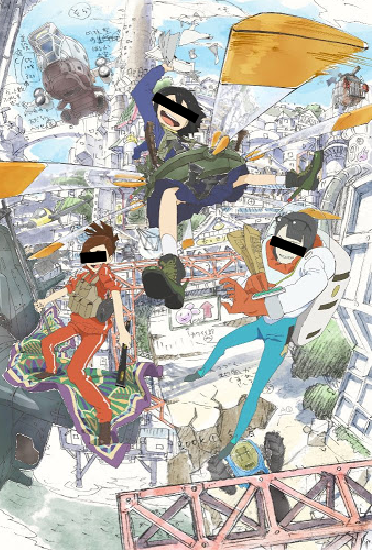
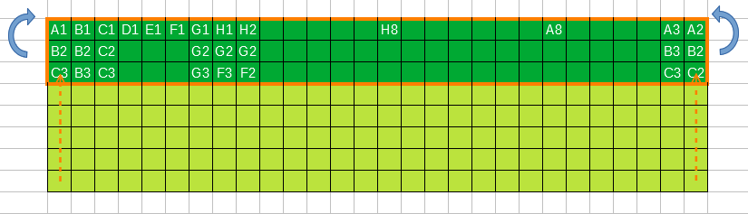

# 私の考えた最強のオセロAI。

「私の考えた最強のオセロAI。」
と言うことで、どうせ会社の人しか見ないので大風呂敷を広げてみました。:smile:  
コンセプトは「すべての手番で1秒以内に差し手を返すオセロAI」です。  
皆で分担してオセロAIを作成できるといいな？と考えています。

前回の新人オセロでは、K本さんのAIは時間がかかるので、速いアルゴリズム版に差し替えていました。  
そこで、時間をかければ(読み手数を増やせば)強くなるが、あえて全手1秒以内と制約を付けたら面白いのでは？  
と考えました。

オセロAIのイメージはざっくりと以下のように考えています。

- 序盤      オープニングブックで差し手を決定
- 中盤      ディープラーニング＋ロールアウトで差し手を決定
- 終盤      勝敗完全探索で差し手を決定

上記アルゴリズムをそれぞれ分担する以外にも、自動対戦を検討したり棋譜を集めたり  
いろいろ作業は分担できそうです。

オセロのリファレンスには、以下のアプリを参考にしています。

「MasterReversi Home Page」  
http://t-ishii.la.coocan.jp/hp/mr/index.html

シェアウェアですが、ヘルプはとても参考になるので、興味がある人はダウンロードしてみてください。

また、オープンソースでは以下が有名なようです。

「abulmo/edax-reversi」  
https://github.com/abulmo/edax-reversi

「もしオセロの初心者がEdaxの評価関数を読んだら」  
https://qiita.com/tanaka-a/items/6d6725d5866ebe85fb0b

上記を参考にしながら、少しずつ更新できればと思ってます。  
まだREADMEだけでプロジェクトの側すらない状態ですが。。。:sweat:  

以上。

追伸＞  
ちなみにディープラーニング部分のアイディアは、以下のように考えています。

オセロを「既存の石に隣接する形で交互に石を置きながら、空白領域を分割するゲーム」と定義し  
「空白領域の分割は石が辺に接したときのみ発生する」との予想から  
「盤面の周囲3マスから特長量を抽出してCNNで学習する」と考えています。  

イメージ図は以下になります。

